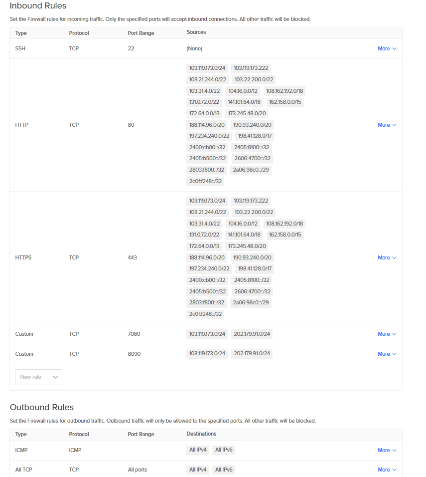
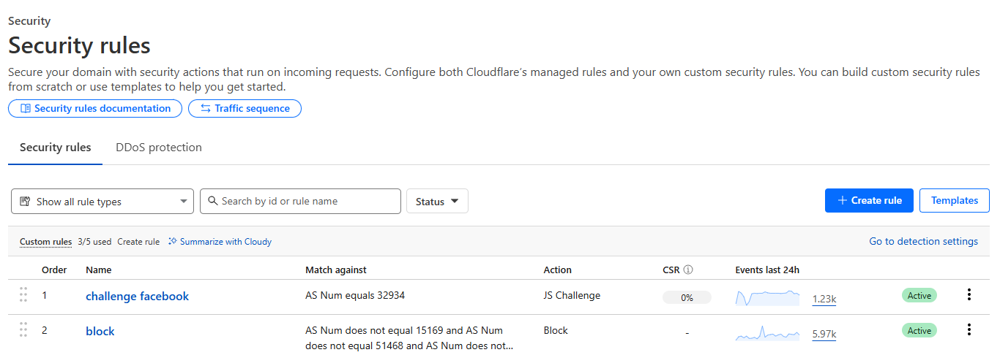
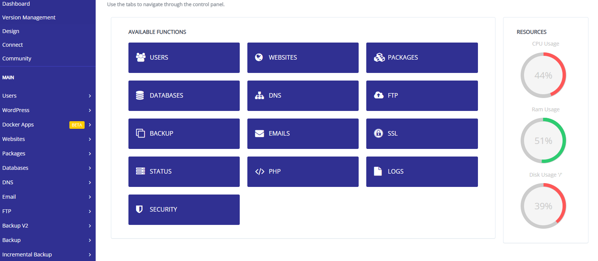

# 🚀 Secure WooCommerce Deployment on DigitalOcean with CyberPanel & Cloudflare

## 📌 Project Overview
This project demonstrates the deployment of a **WooCommerce e-commerce site** on a **DigitalOcean Droplet** using **CyberPanel (OpenLiteSpeed)**.  
The focus is on **security, encryption, and data protection** through Cloudflare, strict firewall rules, and multi-layer backup strategies.  

This setup is suitable for **small to medium e-commerce businesses** looking for cost-effective yet secure hosting.

---

## 🏗️ Architecture
- **Platform**: DigitalOcean Droplet (Ubuntu)  
- **Control Panel & Web Server**: CyberPanel (OpenLiteSpeed)  
- **Database**: MariaDB (installed via CyberPanel)  
- **SSL/TLS**: Let’s Encrypt (90-day auto renewal) + Cloudflare Universal SSL  
- **CDN & Security**: Cloudflare (DNS, CDN, WAF, DDoS Protection)  
- **Backups**: CyberPanel scheduled backups + DigitalOcean Snapshots  

---

## 🔐 Security Configuration

### 🔹 SSL & Certificates
- Configured **Let’s Encrypt SSL** from CyberPanel dashboard.  
- Enabled **Cloudflare SSL/TLS** for end-to-end encryption.  

### 🔹 Firewall (DigitalOcean)
- Restricted inbound traffic to only essential ports:
  - **22 (SSH)** → Admin IP only  
  - **80 (HTTP) & 443 (HTTPS)** → Allowed via DigitalOcean/Cloudflare ranges only  
  - **7080 & 8090** (CyberPanel) → Restricted to specific IPs  
- Outbound rules restricted to essential traffic (updates, DNS).  

📸 Firewall Rules:  

### 🔹 Cloudflare Security
- Applied **Custom Security Rules**:
  - Block unknown/untrusted ASNs  
  - JS Challenge for suspicious requests  
- Enabled **DDoS protection & caching** for resilience  

📸 Cloudflare Security Rules:  

---

## 💾 Backup & Recovery

- **Application-Level Backups** via CyberPanel (daily/weekly schedule)  
- **Infrastructure-Level Backups** via DigitalOcean Snapshots (daily/hourly)  
- **Cloudflare Caching** as additional safeguard against downtime  

📸 CyberPanel Backup:  

---

## ✅ Key Outcomes

- **Secure E-commerce Hosting** with end-to-end encryption  
- **Firewall Hardening** minimizing attack surface  
- **Layered Backups** protecting application + infrastructure  
- **Resilient Performance** using Cloudflare CDN + caching  
- **Practical, real-world deployment** for DigitalOcean & CyberPanel  

---

## 📚 Future Enhancements

This is **Phase 1 (Single-Server Secure Setup)**.  
Next phases will include:  

- **High Availability (HA)** → Multi-droplet with load balancing & DB replication  
- **Disaster Recovery (DR)** → Cross-region snapshots & automated restore pipelines  

---

## 🔖 Topics & Keywords
WooCommerce • CyberPanel • DigitalOcean • Cloudflare • SSL/TLS • Firewall • Backup • Security • CDN • DevOps • E-commerce Hosting
